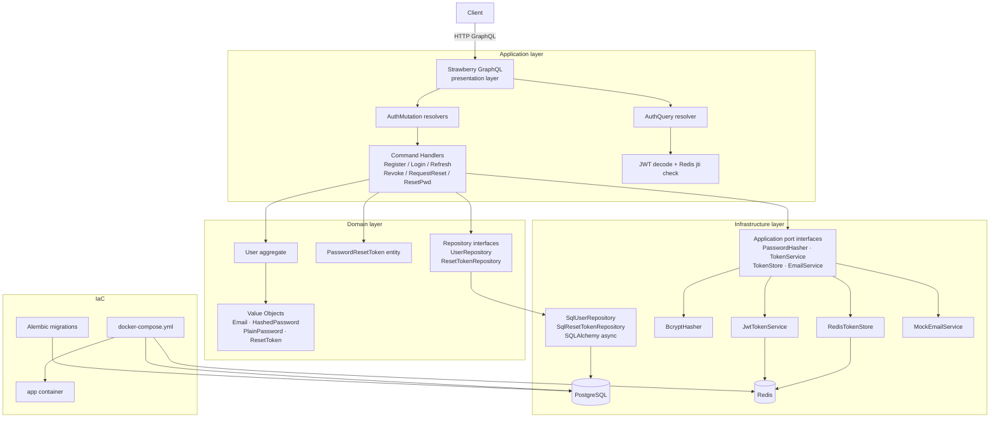

# Auth Module — PintoPay Engineering Challenge

Production-quality authentication service demonstrating DDD, CQRS, IaC, and security-first
design. Three user flows: Registration, Login, and Password Recovery.

---

## Make commands

| Command | Description |
|---|---|
| `make run_l` | Start all services (app, postgres, redis) in background |
| `make stop_l` | Stop all services |
| `make test` | Run full test suite inside Docker Compose network |
| `make test_unit` | Run unit tests locally (no services required) |

---

## Stack

| Layer | Technology |
|---|---|
| Language | Python 3.12 |
| API | FastAPI + Strawberry GraphQL |
| ORM | SQLAlchemy 2.0 async |
| Database | PostgreSQL 16 |
| Session store | Redis 7 |
| Migrations | Alembic |
| Auth | bcrypt (cost 12) + PyJWT + opaque refresh tokens |
| Rate limiting | SlowAPI (Redis backend) |
| Logging | structlog (JSON in production, console in dev) |
| Testing | pytest + pytest-asyncio + httpx |

---

## How to run

### Prerequisites

- Docker and Docker Compose plugin
- (Optional) Python 3.12 + pip for local development without Docker

### Start everything

```bash
cp .env.example .env            # review and adjust secrets
docker compose -f docker/docker-compose.yml up --build
```

The app starts at http://localhost:8000/graphql (GraphQL Playground).

On startup the container automatically runs `alembic upgrade head` before launching uvicorn,
so the database schema is always up to date.

### Quick start — register a user

```bash
curl -X POST http://localhost:8000/graphql \
  -H "Content-Type: application/json" \
  -d '{
    "query": "mutation Register($input: RegisterInput!) { register(input: $input) { success message } }",
    "variables": { "input": { "email": "user@example.com", "password": "SecurePass123!" } }
  }'
```

See `manual_curl_examples.sh` for login, idempotency key usage, and other operations.

### Environment variables

| Variable | Default | Description |
|---|---|---|
| DB_URL | (required) | asyncpg connection string |
| REDIS_URL | (required) | Redis connection string |
| JWT_SECRET | (required) | HS256 signing key |
| ACCESS_TOKEN_EXPIRE_MINUTES | 15 | Access JWT lifetime |
| REFRESH_TOKEN_EXPIRE_DAYS | 30 | Refresh token lifetime |
| RESET_TOKEN_EXPIRE_MINUTES | 15 | Password-reset token lifetime |
| LOG_FORMAT | json | Log format: `json` for production, `console` for human-readable dev output |
| DB_TEST_URL | (postgres service default) | asyncpg URL for the `auth_test` database; used by integration tests |
| REDIS_TEST_URL | (redis service default) | Redis URL for GraphQL integration tests (DB index 2) |
| REDIS_TOKEN_TEST_URL | (redis service default) | Redis URL for token store integration tests (DB index 1) |

### Run tests

```bash
# Unit tests only (no services required — run locally)
pytest tests/unit/ -v

# Full suite including integration tests (requires Docker Compose network)
docker compose -f docker/docker-compose.yml run --rm app pytest tests/ -v
```

Integration tests connect to `postgres` and `redis` by Docker service name and must run
inside the Compose network. Running `pytest tests/integration/` outside Docker will fail
with a connection error.

---

## Architecture diagram



### Request flow — Login

```
Client  →  POST /graphql  →  AuthMutation.login
           ↓
           AuthenticateUserHandler
           ↓
           SqlUserRepository.find_by_email        [Postgres read]
           ↓
           BcryptHasher.verify                    [CPU]
           ↓
           JwtTokenService.generate_access_token  [UUID jti + HS256]
           JwtTokenService.generate_refresh_token [secrets.token_urlsafe]
           ↓
           RedisTokenStore.create_session          [pipeline: 4 Redis ops]
           ↓
           AuthPayload { accessToken, refreshToken, tokenType }
```

---

## Where DDD, CQRS, and IaC appear

### Domain-Driven Design

The bounded context is **Identity**. Domain knowledge lives exclusively in `auth_service/domain/`:

- **Value objects** (`domain/value_objects/`) enforce invariants at construction time.
  `Email` normalises and validates format. `PlainPassword` enforces minimum length and digit
  requirement. Neither ORM nor framework types leak into the domain.
- **Entities and aggregate root** (`domain/entities/`). `User` is the aggregate root.
  `PasswordResetToken.consume()` enforces two independent invariants: TTL expiry check first,
  then single-use check — the ordering is an explicit domain rule, not a database constraint.
- **Repository interfaces** (`domain/repositories/`) are pure Python ABCs. The domain layer
  has zero knowledge of SQLAlchemy, Redis, or any infrastructure detail.
- **Domain exceptions** (`domain/exceptions.py`) express ubiquitous language:
  `TokenExpiredError`, `UserAlreadyExistsError`, `InvalidCredentialsError`, etc.

### CQRS

The application layer (`auth_service/application/`) is split by side:

- **Command side** (`application/commands/`): one handler per mutating operation.
  Each handler receives a command DTO, calls domain objects and repository interfaces,
  and returns void or a DTO. No SQLAlchemy sessions, no HTTP concerns.
- **Query side**: the `me` GraphQL query is handled directly in the resolver — it decodes
  the JWT, checks the jti allowlist in Redis, and returns user info. No command handler
  needed for a stateless read with no domain rules.
- Strawberry mutations map cleanly to commands; the single query maps to a read.

### Infrastructure as Code

- `docker/docker-compose.yml` defines the full local environment: `app`, `postgres` (with
  healthcheck and persistent volume), `redis` (Redis 7 with healthcheck and persistent volume).
- `docker/postgres/init.sql` creates both `auth` (production) and `auth_test` databases.
- `docker/Dockerfile` is multi-stage, uses Python 3.12-slim, runs as a non-root user.
- `alembic/` contains the migration history. Migrations run automatically on container start.
- `.env.example` documents every required environment variable.

---

## Key trade-offs

### Redis token allowlist vs pure stateless JWT

Pure stateless JWT cannot satisfy the fintech requirement of immediate token revocation
(compromised account, fraud detection, forced logout). A Redis allowlist adds ~0.2 ms per
authenticated request but enables sub-millisecond revocation at scale. A blocklist was
rejected because it grows unboundedly; an allowlist is bounded by active session count.

### Email enumeration in password reset

`RequestPasswordResetHandler` raises `UserNotFoundError` when the email is not registered.
The security-correct approach (return an identical success response regardless) prevents email
enumeration — an attacker cannot probe which addresses are registered. This was consciously
rejected in favour of explicit UX feedback. If the threat model changes, the fix is a
one-line change in the handler: replace the raise with `return`.

### No hard account lockout

Hard lockout (block account after N failed attempts) enables a DoS vector: an attacker can
lock out any legitimate user by deliberately triggering the limit. Rate limits (SlowAPI,
Redis backend) apply per-IP and per-email, providing exponential backoff protection without
creating a lockout DoS surface. This is documented in the rate limiter source.

### Python over Go/TypeScript

Primary reason: production Python experience enables meaningful architectural review and
validation of decisions; other stacks would produce code that cannot be critically evaluated.
Secondary: Strawberry provides code-first GraphQL that maps cleanly to DDD types, async
SQLAlchemy 2.0 is mature, FastAPI has excellent async support. Trade-off acknowledged: lower
raw throughput than Go, but auth service bottlenecks are Redis/Postgres I/O, not CPU.

### Layered DDD over hexagonal architecture

Classic hexagonal (ports and adapters) with explicit primary/secondary port separation adds
ceremony that is not justified at this scope. The current structure (domain → application
ports → infrastructure adapters) achieves the same dependency inversion with less indirection.
See ADR-0002 for the full analysis.

---

## Next steps for production

1. **Observability**: add Prometheus metrics (request latency, error rates, Redis hit ratio),
   OpenTelemetry tracing (trace IDs in structlog context), and Grafana dashboards.

2. **Kubernetes / Helm**: replace Docker Compose with a Helm chart. Secrets via Kubernetes
   Secrets or Vault. Horizontal Pod Autoscaler on the app deployment.

3. **Real email delivery**: swap `MockEmailService` for SendGrid/SES with retry logic and
   delivery tracking. Consider a transactional email queue (SQS/RabbitMQ) so reset emails
   are decoupled from the request path.

4. **mTLS between services**: use a service mesh (Linkerd or Istio) for mutual TLS between
   app, Postgres, and Redis. Policy-driven networking to block lateral movement.

5. **Key rotation**: support multiple JWT signing keys (JWKS endpoint) so secrets can be
   rotated without forcing all users to re-login. Implement a key ID (`kid`) claim.

6. **Multi-factor authentication**: TOTP (RFC 6238) as a second factor. The domain model
   already supports extension — add a `TotpCredential` entity to the `User` aggregate.

7. **Schema evolution strategy**: add a migration CI step that runs `alembic check` against
   the target database and rejects backward-incompatible column removals without a deprecation
   window. Shadow migrations for zero-downtime schema changes.

8. **Audit log**: append-only event log (Postgres insert-only table or event stream) for
   all auth events (login, logout, password change, failed attempts) to satisfy compliance
   requirements.

---

## ADRs

Architecture Decision Records are in `docs/adr/`:

- [ADR-0001: GraphQL over gRPC/REST](docs/adr/0001-graphql-over-rest.md)
- [ADR-0002: Layered DDD over hexagonal architecture](docs/adr/0002-layered-ddd.md)
- [ADR-0003: Python stack choice](docs/adr/0003-python-stack.md)

---

## AI usage

See `.agents/` for documentation of how AI tools were used in building this solution.
